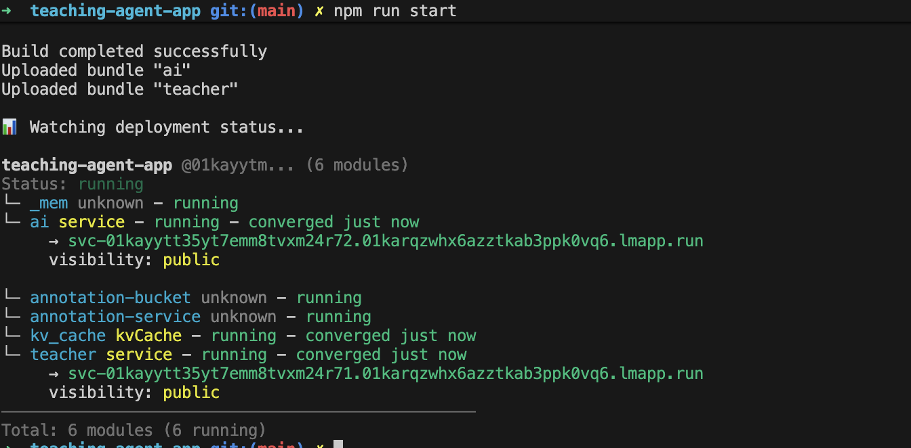

# Local Dev Setup
First time run the repo, install dependency
```bash
npm install
```

Run local
```bash
npm run start
```


The server is running on: 
svc-01kayytt35yt7emm8tvxm24r72.01karqzwhx6azztkab3ppk0vq6.lmapp.run

# Test API
Use postman do the CRUD testing.

